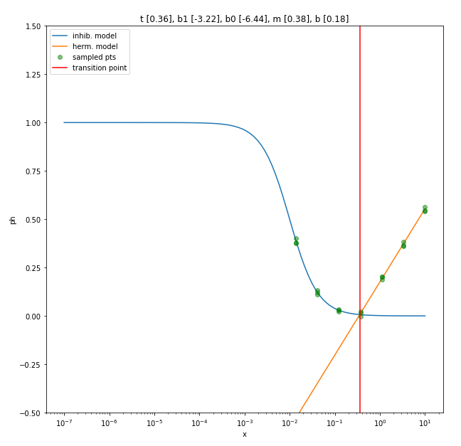

# synthetic_doseresponse_generator
This repo contains the methods necessary to simulate hermetic dose-response curves with a variety of parameter choices. 

Interactive notebook:   

# data dictionary 

> `DOSE_XXX`: cell_viability value [0,1] for the dose point XXX. 

> `b`: hermetic model intercept 

> `m`: hermetic model slope

> `b0`: logistic regression parameter 

> `b1`: logistic regression parameter

> `s`: sampling noise

> `t`: hermetic transition point 

> `id`: unique identifier for each transition

